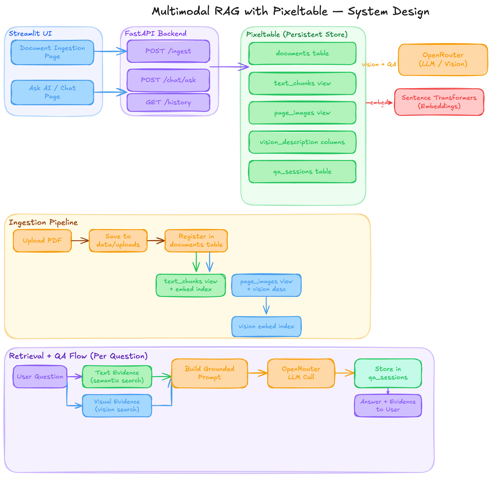
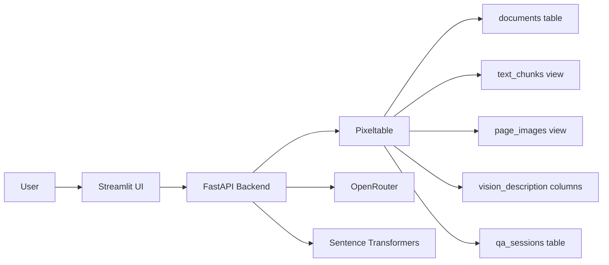
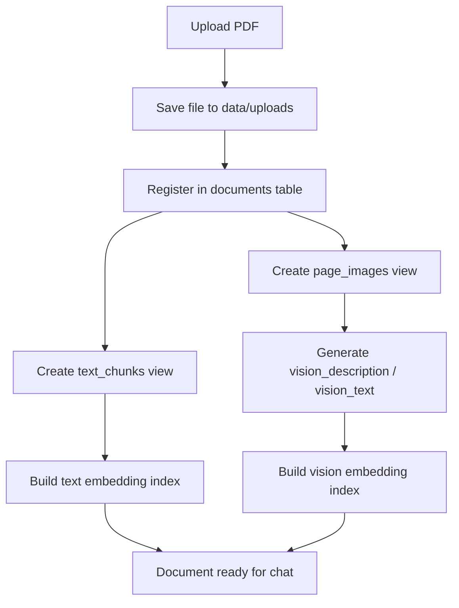
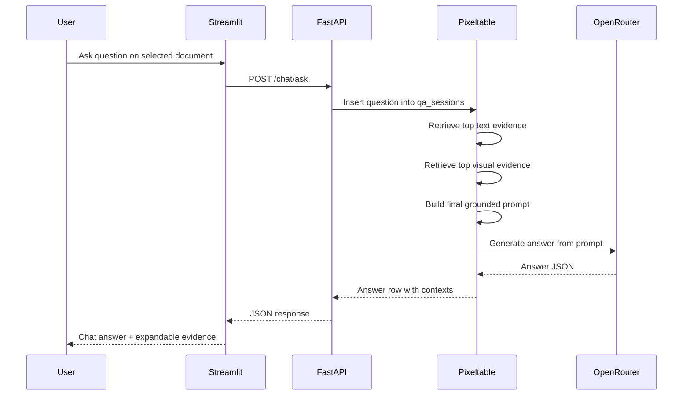

# Multimodal RAG with Pixeltable

Production-style multimodal PDF RAG system built with `Pixeltable`, `FastAPI`, `Streamlit`, and `OpenRouter`.

This project is designed for PDFs that contain more than plain text: paragraphs, figures, charts, tables, scanned layouts, and page-level visual context. The app ingests those documents into a multimodal retrieval pipeline and lets users chat against a selected document with grounded answers.

## Why This Project Exists

Most RAG examples stop at plain text chunking. That works for text-heavy PDFs, but it often loses crucial information from:

- charts and graphs
- tables with visual structure
- scanned pages
- diagrams and callouts
- layout-driven meaning

This project approaches the problem differently:

1. keep a text retrieval path for semantic chunk search
2. keep a visual retrieval path for page-level vision understanding
3. merge both when answering questions

That lets the final assistant reason over both the textual and visual evidence of a document instead of pretending every PDF is just plain text.

## Product Overview

The app has two user-facing pages:

- `Document Ingestion`
  Upload a PDF and run the full ingestion pipeline.
- `Ask AI`
  Select a document and chat with grounded answers generated from retrieved text and visual evidence.

The runtime is split into:

- `FastAPI` backend for ingestion, retrieval, QA, and history APIs
- `Streamlit` frontend for the product UI
- `Pixeltable` for persistent multimodal tables, views, computed columns, and indexes

## Demo

Take a quick look at the working app demo:-

[Watch the demo on YouTube](https://youtu.be/DZQZVo5HToQ)

## How I Approached The Problem

The implementation was built incrementally so each stage could be verified before adding the next one.

### 1. Build a durable document registry

Every uploaded PDF is first registered in a base Pixeltable table:

- `documents`

This gives the system a stable source of truth before any derived processing begins.

### 2. Create a text-first retrieval path

The document is split into text chunks using Pixeltable document splitting so the app can support standard semantic retrieval for prose-heavy questions.

### 3. Create a visual retrieval path

Each PDF page is also extracted as an image. This is intentional: it preserves figures, charts, table layouts, and page structure that text extraction alone can miss.

### 4. Turn visuals into searchable evidence

Page images are sent to an OpenRouter vision-capable model, which generates page-level textual descriptions. Those descriptions become the searchable representation of the visual modality.

### 5. Build hybrid retrieval

Two evidence channels are indexed:

- text chunk embeddings
- vision-description embeddings

At query time, both are searched independently and then used together as grounded context.

### 6. Build grounded QA, then chat

Instead of directly prompting a model with the raw PDF, the system:

1. retrieves top text evidence
2. retrieves top visual evidence
3. builds a grounded prompt
4. generates a final answer
5. stores the result in a persistent QA/chat table

That same stored QA table powers the document-specific chat history in the UI.

## Architecture

### Full architectural block diagram



### High-level system



### Ingestion pipeline



### Backend logic for a chat question



## Pixeltable Objects

The core objects created by the app are:

- `multimodal_rag.documents`
  Base source table for uploaded PDFs
- `multimodal_rag.text_chunks`
  Derived text chunk view
- `multimodal_rag.page_images`
  Derived page image view
- `multimodal_rag.qa_sessions`
  Persistent QA/chat table

This design keeps the source document, derived text representation, derived visual representation, and final QA state separate and inspectable.

## Backend Logic Step-by-Step

### Document ingestion

When a user uploads a document:

1. the file is written into `data/uploads`
2. the PDF is registered in the `documents` table
3. a text chunk view is ensured
4. a page image view is ensured
5. a vision-description layer is ensured if `OPENROUTER_API_KEY` is configured
6. embedding indexes are ensured for retrieval

### Retrieval

For every question, the backend prepares two retrieval channels:

- `text_evidence`
  Similarity search over `text_chunks.text`
- `visual_evidence`
  Similarity search over `page_images.vision_text`

### Grounded answer generation

The final prompt includes:

- selected document name
- user question
- top retrieved text evidence
- top retrieved visual evidence

The answer model is instructed to answer only from that evidence and to say when the evidence is insufficient.

## Repository Structure

```text
app.py                    # single-command launcher for backend + frontend
src/api/                  # FastAPI application
src/chat/                 # grounded QA and chat history
src/config/               # settings and environment loading
src/core/                 # Pixeltable bootstrap and schema
src/ingestion/            # file saving and full ingestion pipeline
src/processing/           # text, page-image, and vision processing
src/retrieval/            # hybrid retrieval logic
src/ui/                   # Streamlit frontend
src/utils/                # logging and shared exceptions
```

## Logging and Error Handling

This app includes:

- application-level `logger.info(...)` across ingestion, retrieval, QA, and API steps
- centralized FastAPI exception handling
- UI-to-API error boundaries through a shared API client

That makes it easier to trace:

- document registration
- view/index creation
- question processing
- backend failures

## Running Locally

### Prerequisites

- Python `>3.10,<3.14`
- an `OPENROUTER_API_KEY`
- `uv` installed locally

### 1. Install dependencies

```bash
env UV_CACHE_DIR=/tmp/uv-cache uv sync
```

### 2. Create `.env`

Use `.env.example` as a base.

Example:

```env
OPENROUTER_API_KEY=your_openrouter_api_key_here
MMRAG_CHAT_MODEL=qwen/qwen3-14b
MMRAG_VISION_MODEL=qwen/qwen3-vl-8b-instruct
MMRAG_EMBEDDING_MODEL=sentence-transformers/all-MiniLM-L6-v2
MMRAG_PIXELTABLE_NAMESPACE=multimodal_rag
MMRAG_API_HOST=127.0.0.1
MMRAG_API_PORT=8000
MMRAG_STREAMLIT_PORT=8501
MMRAG_LOG_LEVEL=INFO
```

### 3. Start the full app

```bash
python -m app
```

This starts:

- FastAPI on `http://127.0.0.1:8000`
- Streamlit on `http://127.0.0.1:8501`

## Running with Docker

### Build the image

```bash
docker build -t multimodal-rag .
```

### Run the container

```bash
docker run --rm -p 8000:8000 -p 8501:8501 \
  -e OPENROUTER_API_KEY=your_openrouter_api_key_here \
  -e MMRAG_API_HOST=0.0.0.0 \
  -e MMRAG_API_PORT=8000 \
  -e MMRAG_STREAMLIT_PORT=8501 \
  multimodal-rag
```

Then open:

- `http://localhost:8501` for the UI
- `http://localhost:8000/health` for the backend health check

## Notes on Docker

- The Docker image runs the same single command: `python -m app`
- It installs OS packages needed for PDF/image processing
- Pixeltable data will live inside the container unless you mount a volume

Example with a persistent volume:

```bash
docker run --rm -p 8000:8000 -p 8501:8501 \
  -e OPENROUTER_API_KEY=your_openrouter_api_key_here \
  -v $(pwd)/.pixeltable:/app/.pixeltable \
  -v $(pwd)/data/uploads:/app/data/uploads \
  multimodal-rag
```

## Tech Stack

- `Pixeltable`
- `FastAPI`
- `Streamlit`
- `OpenRouter`
- `Sentence Transformers`
- `spaCy`

## License

This project is released under the **MIT License**.
